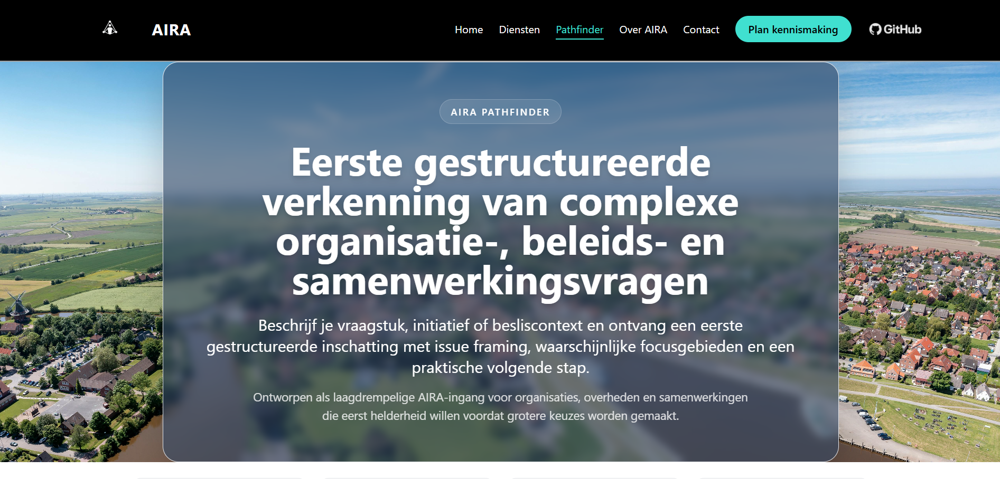
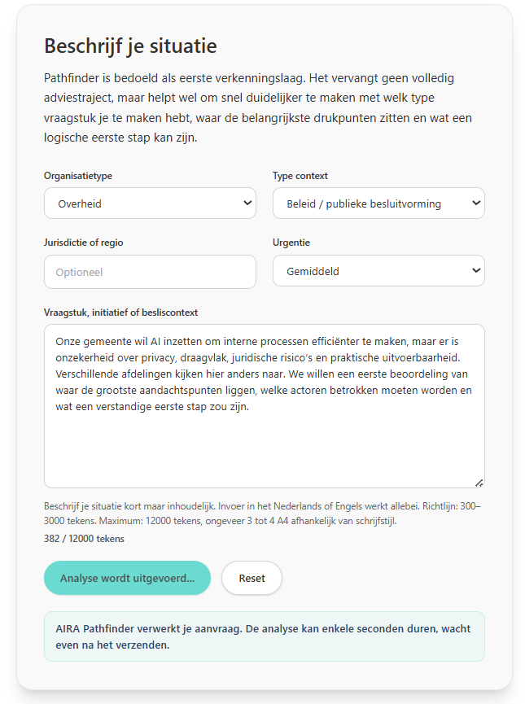
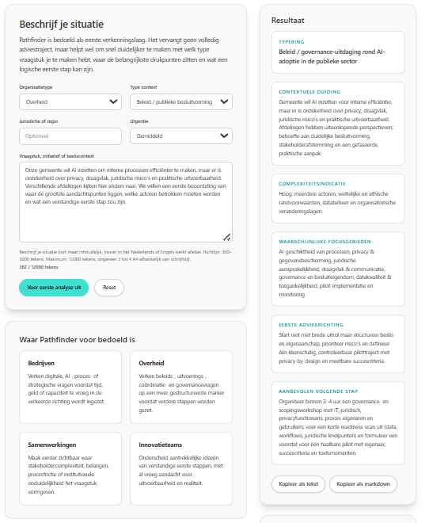

# AIRA Pathfinder Showcase

Structured AI first assessment flow for complex business and public-sector questions.

## Screenshots

### Pathfinder overview

### Pathfinder input

### Pathfinder result

## Overview

AIRA Pathfinder is designed as a lightweight entry point for organizations that need an initial framing of a complex issue before moving into deeper advisory work.

The showcase demonstrates how a user can submit a question or challenge and receive:

- an issue framing
- a complexity indication
- likely focus areas
- a first advisory direction

## What this repository demonstrates

- product thinking for AI-assisted advisory workflows
- structured intake design
- practical AI UX for first assessments
- public-sector and business-oriented framing
- rapid MVP-style implementation logic

## Example use cases

- strategic intake for municipalities
- early framing of policy and governance questions
- first assessment of business transformation challenges
- multi-stakeholder issue exploration

## Stack used in the live project

The broader implementation around AIRA Pathfinder has involved technologies such as:

- FastAPI
- Python
- Render
- OpenAI API
- website integration via AIRA
- structured prompt / response handling

## Notes

This repository is a public showcase repository. It is intended to demonstrate product direction, implementation style, and interaction design.

It does **not** expose sensitive internal logic, private configuration, secrets, or proprietary orchestration components.

## Website

[AIRA](https://www.aira-ai.com)

## Author

Arjen Wibbens  
Founder, AIRA
